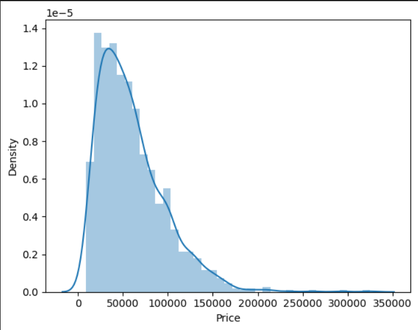
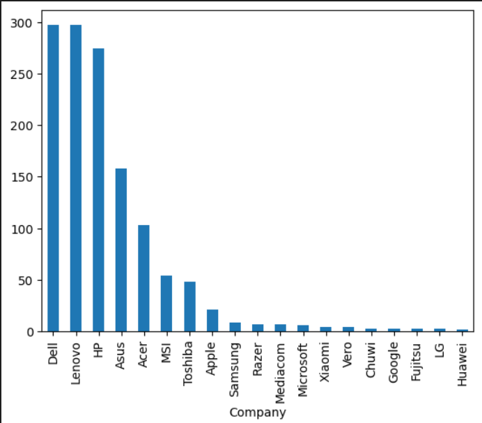
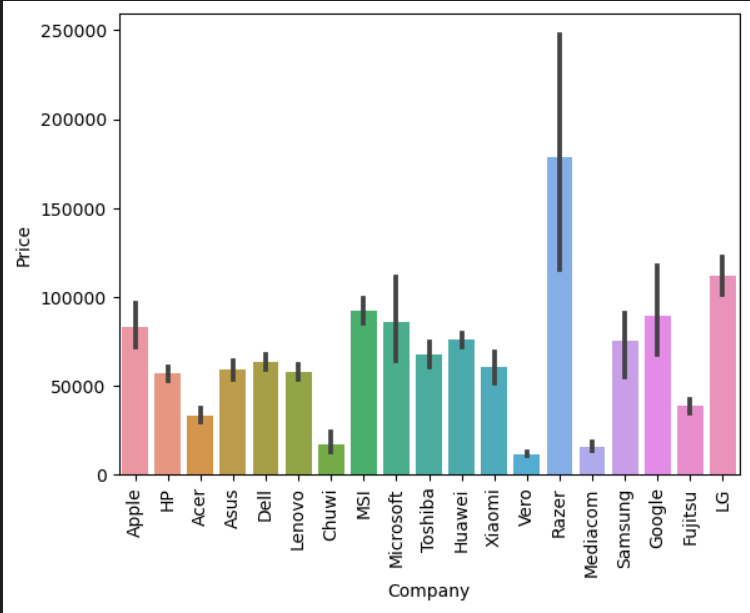
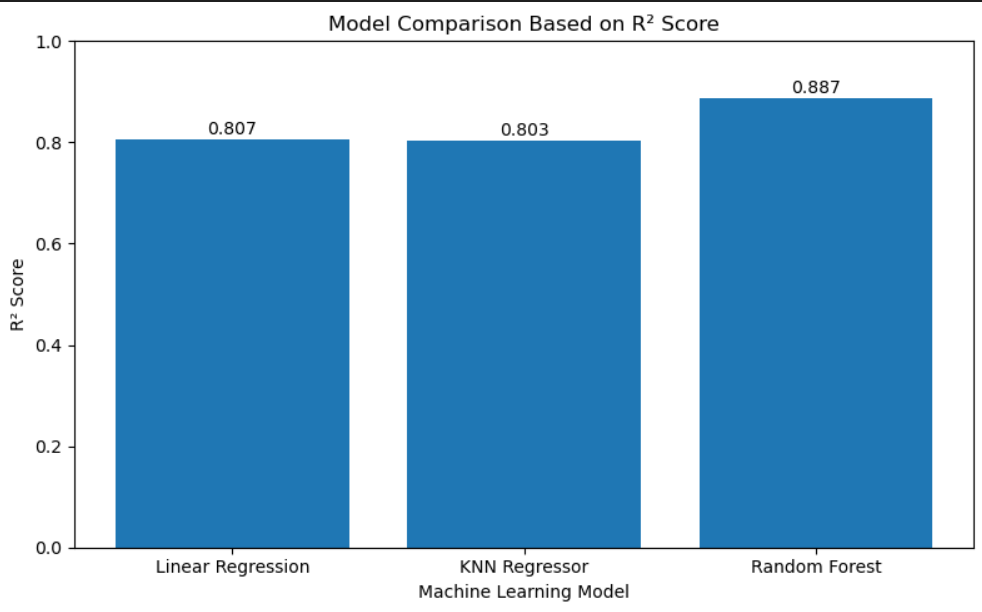
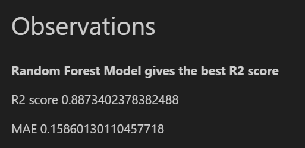

# Laptop Price Prediction

Laptop Price Prediction is a machine learning project that predicts laptop prices based on hardware specifications and categorical features such as company, laptop type, RAM, weight, touchscreen availability, IPS display, processor, storage, GPU, and operating system.

The project applies data preprocessing, feature engineering, exploratory data analysis, and regression models to estimate laptop prices from structured specification data.

---

## Project Overview

Laptops are available in many brands, models, and hardware configurations. Small differences in specifications such as RAM, processor, storage, screen quality, and GPU can significantly affect the price.

This project uses machine learning to predict laptop prices based on these specifications. The goal is to build a data-driven pricing model that can support price estimation for consumers, sellers, and e-commerce platforms.

---

## Problem Statement

Laptop pricing is often difficult because prices depend on many technical and brand-related factors. Manual price comparison can be time-consuming and subjective.

The objective of this project is to build a machine learning regression model that can predict laptop prices using structured laptop specification data.

---

## Objectives

- Analyze laptop specification data
- Clean and preprocess raw laptop features
- Extract useful features from columns such as RAM, weight, screen resolution, CPU, memory, GPU, and OS
- Perform exploratory data analysis
- Train and compare regression models
- Evaluate models using R² score and Mean Absolute Error
- Identify the best-performing model for laptop price prediction

---

## Dataset

The dataset used in this project is:

```text
laptop_data.csv
```

The dataset contains laptop specifications and price information.

### Dataset Features

| Feature | Description |
|---|---|
| Company | Laptop brand or manufacturer |
| TypeName | Type/category of laptop |
| Inches | Screen size |
| ScreenResolution | Screen resolution details |
| Cpu | Processor information |
| Ram | RAM capacity |
| Memory | Storage information |
| Gpu | Graphics card information |
| OpSys | Operating system |
| Weight | Laptop weight |
| Price | Target variable representing laptop price |

---

## Feature Engineering

Several new features were created from existing columns:

| Engineered Feature | Description |
|---|---|
| Touchscreen | Indicates whether the laptop has a touchscreen |
| IPS | Indicates whether the laptop has an IPS display |
| PPI | Pixels per inch calculated from screen resolution and screen size |
| CPU Brand | Extracted processor category from CPU details |
| HDD | HDD storage capacity extracted from memory column |
| SSD | SSD storage capacity extracted from memory column |
| GPU Brand | Extracted graphics card brand |
| OS | Simplified operating system category |

---

## Data Preprocessing

The following preprocessing steps were performed:

- Removed unnecessary columns
- Cleaned RAM and weight columns by removing units
- Converted RAM and weight into numerical values
- Extracted touchscreen and IPS information from screen resolution
- Calculated PPI from screen resolution and screen size
- Extracted CPU brand from processor details
- Split memory column into HDD and SSD
- Extracted GPU brand
- Simplified operating system categories
- Applied One-Hot Encoding for categorical variables
- Applied log transformation to the target variable `Price`

---

## Machine Learning Models

The following regression models were trained and compared:

- Linear Regression with Lasso Regularization
- K-Nearest Neighbors Regressor
- Random Forest Regressor

---

## Model Evaluation

The models were evaluated using:

| Metric | Description |
|---|---|
| R² Score | Measures how well the model explains price variation |
| Mean Absolute Error | Measures the average absolute prediction error |

Random Forest Regressor achieved the best performance among the tested models.

---

## Final Model

The final selected model is:

```text
Random Forest Regressor
```

Random Forest performed better because it can capture non-linear relationships and complex interactions between laptop specifications.

---

## Tools and Libraries Used

- Python
- Jupyter Notebook
- Pandas
- NumPy
- Matplotlib
- Seaborn
- Scikit-learn

---

## Project Structure

```text
Laptop-Price-Prediction/
│
├── README.md
├── requirements.txt
├── .gitignore
│
├── data/
│   ├── README.md
│   └── laptop_data.csv
│
├── notebooks/
│   ├── README.md
│   └── laptop_price_prediction.ipynb
│
├── reports/
│   ├── README.md
│   ├── laptop_price_prediction_report.pdf
│   └── laptop_price_prediction_presentation.pptx
│
└── images/
    ├── README.md
    ├── price_distribution.png
    ├── company_distribution.png
    ├── company_price_comparison.png
    ├── model_comparison.png
    └── random_forest_result.png
```

---

## Key Visualizations

### Price Distribution

This graph shows the distribution of laptop prices in the dataset. It helps understand the spread and skewness of the target variable.



### Company Distribution

This bar chart shows the number of laptops available from each company in the dataset.



### Company-wise Price Comparison

This chart compares laptop prices across different companies and helps identify brand-level pricing differences.



### Model Comparison

This chart compares the performance of Linear Regression, KNN Regressor, and Random Forest Regressor using R² score.



### Random Forest Result

Random Forest Regressor achieved the best performance among the tested models and handled complex feature relationships effectively.



---

## How to Run Locally

### 1. Clone the repository

```bash
git clone https://github.com/Althafk7171/Laptop-Price-Prediction.git
cd Laptop-Price-Prediction
```

### 2. Install required libraries

```bash
pip install -r requirements.txt
```

### 3. Open Jupyter Notebook

```bash
jupyter notebook
```

### 4. Run the notebook

Open:

```text
notebooks/laptop_price_prediction.ipynb
```

Run all cells to reproduce the analysis and model results.

---

## Results

The project compared Linear Regression with Lasso, KNN Regressor, and Random Forest Regressor.

Random Forest Regressor gave the best result with strong predictive performance. It achieved an R² score of approximately 0.887 and a Mean Absolute Error of approximately 0.1586 on the log-transformed target variable.

---

## Reports

This repository includes:

- Final project report
- Project presentation
- Jupyter Notebook
- Dataset
- Visualization images

---

## Limitations

- The model is trained on historical laptop specification data.
- Price prediction may vary depending on real-time market changes.
- The dataset may not include all latest laptop models.
- External factors such as offers, availability, and brand demand are not included.
- The project currently focuses on notebook-based prediction and does not include a deployed web application.

---

## Future Scope

- Deploy the model using Streamlit or Flask
- Add real-time laptop price data
- Include more laptop brands and latest models
- Use advanced models such as Gradient Boosting or XGBoost
- Add hyperparameter tuning
- Build a user-friendly laptop price prediction web app
- Add feature importance visualization
- Compare predicted price with actual market price

---

## Contributor

- Muhammed Althaf K

---

## License

This project is developed for academic and learning purposes.
